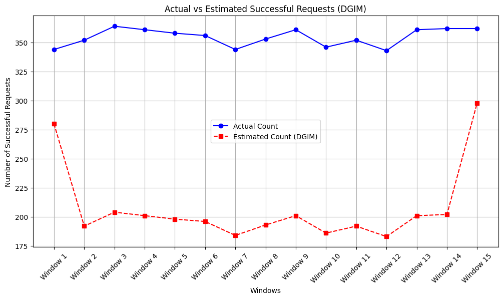

# Stream data analysis

Some of tasks done in this section which is a MDA assignment on stream(simulated) 
news data(*news_dataset_MDA2024*):
- Implementing a streaming data processing system using Structured Streaming in PySpark.
- Process the input data entered into the system continuously and in real time (real-time) from a news source and extract useful information from it.
- Filter the data flow based on different tasks
```markdown
Time: 2024-12-29 12:00:00
Category: PARENTING, Count: 1
Category: CULTURE & ARTS, Count: 1
Category: U.S. NEWS, Count: 5
Category: COMEDY, Count: 1
Category: WORLD NEWS, Count: 2

------------------------------
Time: 2024-12-29 12:00:20
Category: SPORTS, Count: 1
Category: CULTURE & ARTS, Count: 1
Category: U.S. NEWS, Count: 1
Category: WORLD NEWS, Count: 6
Category: TECH, Count: 1

------------------------------
...
```

Some of tasks done in this section which is a MDA assignment on stream(simulated) users' web streaming(*web_streaming_dataset*):

- Get acquainted with the important algorithms in the analysis of stream data and implement these algorithms(DGIM & FM)
- Estimate the number of 1 bits (successful user requests) in each window using the DGIM algorithm
<p align="center">
    
</p>

- Using *FM* algorithm, estimate the number of unique users who have accessed the website.
```markdown
Actual number of unique users: 1491
Estimated number of unique users: 1575.3846153846155
```
